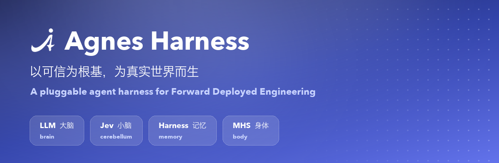
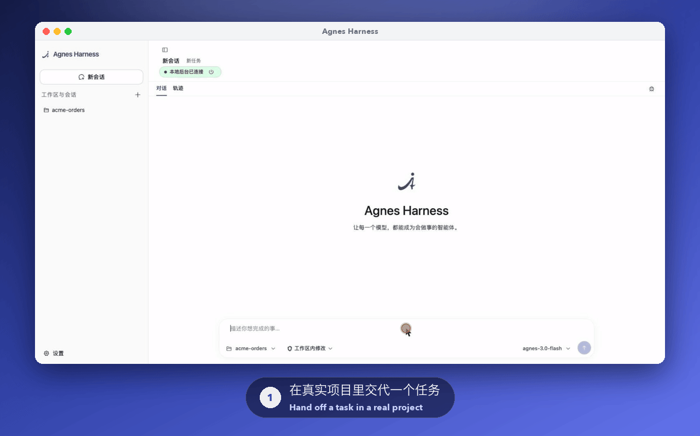
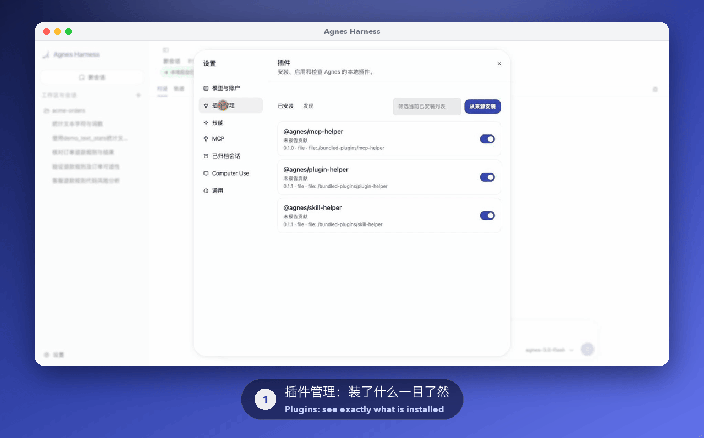
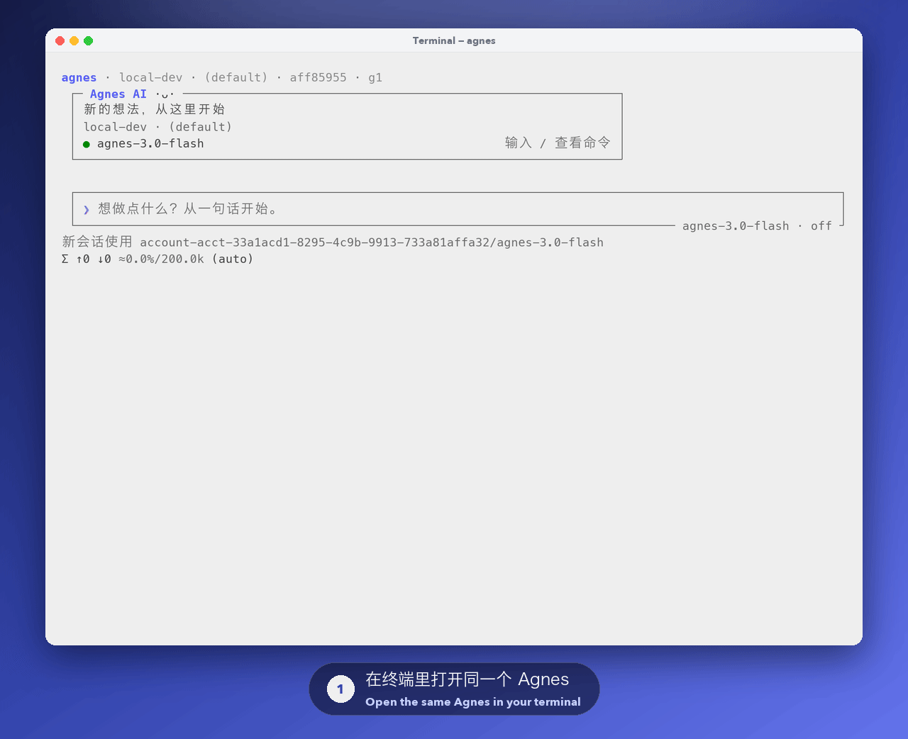
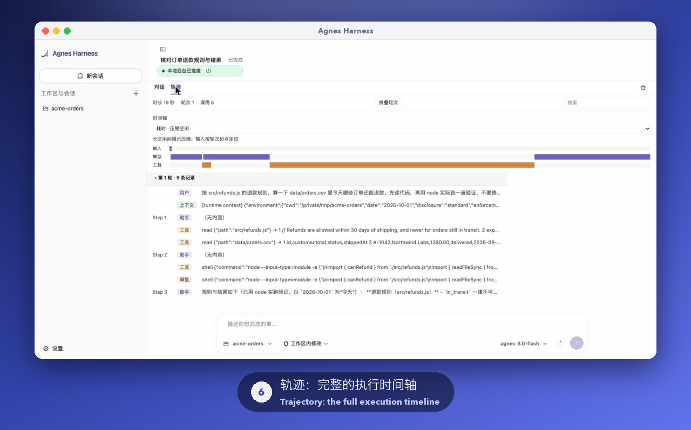

# Agnes Harness

[English](README.md) | 简体中文

<p align="center">
  
</p>

<div align="center">

### 以可信为根基，为真实世界而生。

**把 AI 接入真实业务，让每一次交付沉淀为可复用的能力。**


[快速开始](docs/guide/quickstart.zh-CN.md) · [架构](#architecture) · [体验示例](docs/guide/demo.zh-CN.md) · [开发插件](docs/develop/plugins.zh-CN.md) · [完整文档](docs/README.zh-CN.md) · [MHS（即将开放）](docs/guide/mhs.zh-CN.md)

开发者预览（pre-alpha） · [源码构建](#从源码开始) · [Apache-2.0](LICENSE)

</div>

<p align="center">
  
</p>

<p align="center">
  <b>LLM 是大脑，Jev 是小脑，Harness 是记忆，MHS 是身体。</b><br />
  <sub>同一套底座，支撑企业 FDE 交付与物理世界的 MHS 接入。<a href="#architecture">查看架构</a></sub>
</p>

把 AI 带进真实现场，难点往往不在模型本身，而在客户的业务系统、负责审批的人，以及每个现场都不一样的细节。Agnes Harness（AGH）把模型、工具、任务状态和业务界面连接在一起：**把现场差异写进插件，让 Harness 负责执行并留下记录，把验证过的能力带到下一个项目。**

<p align="center">
  
</p>

<p align="center"><sub>读代码、运行命令前先审批、验证、作答，每一步都留痕。</sub></p>

<details>
<summary><kbd>目录</kbd></summary>

- [AGH 是什么，不是什么](#agh-是什么不是什么)
- [架构：大脑、小脑、记忆与身体](#architecture)
- [在现场交付中，AGH 能帮上什么](#在现场交付中agh-能帮上什么)
- [公开评测](#公开评测)
- [适合谁](#适合谁)
- [从示例开始](#从示例开始)
- [从源码开始](#从源码开始)
- [当前状态](#当前状态)
- [常见问题](#常见问题)
- [关注 AGH，把你的场景带进来](#关注-agh把你的场景带进来)
- [开源许可](#开源许可)

</details>

## AGH 是什么，不是什么

我们面向 Forward Deployed Engineering（FDE）：深入业务现场，把系统集成、使用体验和持续迭代做成可交付的软件。你可以用 CLI 和 Web 开始工作，用插件接入业务系统，用 Skills 沉淀任务方法，再把这些能力组合成自己的 Agent 应用。[了解 FDE 与应用场景 →](docs/guide/why-agh.zh-CN.md)

为了帮你选对试用方式，先说清楚它不是什么：

- **不是托管服务。** AGH 是开发者预览版，需要从源码构建，在你自己的环境中运行。
- **不是任意插件代码的沙箱。** 普通后端插件作为受信代码在进程内运行；审批与命令沙箱作用于相应的受支持执行路径。详见[安全与信任](docs/guide/security.zh-CN.md)。
- **不是经过认证的设备驱动。** MHS 设备接入以 MCP 为基础，即将开放；目前没有可供认证的公开 MHS 规范，实时控制与物理安全仍由设备控制器负责。
- **还没有定型。** API、配置与插件接口仍在演进，可能出现破坏兼容性的变更。

<a id="architecture"></a>
<a id="为扩展而组织的运行基础"></a>

## 架构：大脑、小脑、记忆与身体

大脑、小脑、记忆与身体这组比喻表达 AGH 的产品愿景：把推理、结构化决策、持久任务上下文和物理能力组织到一起。下图展示四个角色在同一套运行时中的位置。


| 角色 | 在 AGH 中意味着什么 | 当前范围 |
| --- | --- | --- |
| **LLM / 大脑** | 理解请求、推理任务、提出行动建议 | 经 AI Provider 接入模型 |
| **Jev / 小脑** | 路由、评分等结构化决策，协助协调执行 | 接入进行中；main 当前使用内置 Core 循环 |
| **Harness / 记忆** | 保存会话历史、任务状态、执行记录，以及沉淀在 Skills 中的可复用方法 | 已有任务上下文与恢复机制；Harness 同时负责执行与治理 |
| **MHS / 身体** | 连接设备能力，让任务读取物理状态、请求设备动作 | 通过基于 MCP 的适配器接入设备；AGH 接入文档与示例即将开放 |

FDE 是交付方式，MHS 负责把设备接进来。两者使用同一套底座，FDE 的现场交付也可以包含设备场景。

| 共享模块 | 当前怎样支撑 FDE | MHS 接入复用什么 |
| --- | --- | --- |
| **App Server / 统一接入** | 为 CLI、Web、SDK 提供共享会话、任务提交、事件推送与审批路由 | 任务入口、人工确认与状态展示 |
| **Agent Loop / 执行循环** | 模型与工具执行、任务状态、事件记录、中断处理与恢复 | 高层设备任务编排与结果记录 |
| **Sandbox / 执行约束** | 工具授权，以及适用的命令、文件、网络与进程约束 | 软件侧执行边界；运动控制、互锁与急停仍由设备控制器负责 |
| **Plugins / 插件体系** | 后端工具与服务、Web 面板、Skills、hooks、MCP，由 Cordis 和包治理组织 | 基于 MCP 的设备适配器与设备操作界面的扩展入口；具体适配仍需开发与验证 |

具体业务连接器与工作台通过这些扩展入口按现场需求构建。当前仓库没有已验证的通用 MHS 适配器或端到端设备示例。

实际请求链路与源码归属见[架构说明](docs/develop/architecture.zh-CN.md)，深入实现可从[源码地图](docs/develop/source-map.zh-CN.md)开始。

## 在现场交付中，AGH 能帮上什么

### 1. 每个客户的业务系统都不一样

Agent 需要调用你的订单查询、知识库、内部接口。如果把这些写进 Agent 本身，每接一个客户就得改一版。

在 AGH 里，业务能力就是插件：通过[后端插件](docs/develop/backend.zh-CN.md)注册工具，或通过 [MCP](docs/guide/mcp.zh-CN.md) 连接已有服务。安装前会先展示版本、来源、完整性摘要、能力哈希和许可证；启用时绑定并校验这些哈希。之后 Agent 就能调用它，每次调用的输入和结构化输出都有记录。

<p align="center">
  
</p>

### 2. 任务在 Web 上开始，在终端里继续

分析人员在浏览器里发起任务，工程师在终端里接手。在工具之间来回复制上下文，历史和决策就丢了。

CLI、Web 与 SDK 共享同一套后台会话。在终端用 `/resume <id>` 恢复 Web 上的会话，历史、工具记录和结论都在；在终端里追加的内容，回到 Web 同样能看到。详见[会话与恢复](docs/guide/sessions.zh-CN.md)。

<p align="center">
  
</p>

### 3. "AI 改了什么？谁批准的？"

在客户环境里，只有结果是不够的，还要说得清它是怎么得出来的。

默认情况下，运行命令要先经你批准：仅允许这次、本会话允许或拒绝。轨迹视图按时间轴记录模型调用、工具与审批，逐步可查。包信任、工具审批、执行约束与会话记录，让集成有明确的控制点。详见[安全与信任](docs/guide/security.zh-CN.md)。

<p align="center">
  
</p>

### 4. 不同岗位需要不同的界面

客服主管和仓库操作员要的不是同一个界面。在 Web 工作台中加入[前端面板](docs/develop/frontend.zh-CN.md)，再通过[前后端联动插件](docs/develop/fullstack.zh-CN.md)以受控的服务调用连接后端。

### 5. 下一个项目应该从上一个项目的终点出发

用 [Skills](docs/guide/skills.zh-CN.md) 沉淀任务方法，把可复用的业务实现打包成插件，按受治理的[生命周期](docs/guide/packages.zh-CN.md)管理：安装、启用、更新、回滚与卸载。

### 6. 现场还有设备

从巡检到仪器协作，现场工作需要把设备状态、人的判断与业务流程连接起来。AGH 的设备接入方向以 MCP（Model Context Protocol）为基础，而不是厂商专属 SDK，让状态读取、动作请求和执行回执进入同一套任务流程。**MHS 接入文档与示例即将开放。**[了解设备接入方向 →](docs/guide/mhs.zh-CN.md)

## 公开评测

在公开的 [Agents' Last Exam（ALE）排行榜](https://agents-last-exam.org/leaderboard)上（评测对象是完整的 Agent 系统：模型 + Harness + 工具，任务来自真实的专业工作场景），Agnes Harness 搭配 Agnes 2.5 Pro Beta 的总通过率为 21.7%，总得分 42.7。

<p align="center">
  
</p>

<p align="center"><sub>成绩随模型版本、设置与工具配置而变化，以榜单最新数据为准。</sub></p>

## 适合谁

- **FDE 与解决方案工程师**：把 Agent 交付进客户的业务系统和流程
- **插件开发者**：把业务工具、服务与界面打包复用
- **需要过程可控的团队**：命令先审批、每一步有记录、插件包信任明确
- **现场与实验室团队**：为设备场景提前准备，跟进 MHS 接入的开放

如果你现在就需要托管服务、已签名的安装包或生产级承诺，AGH 暂时还不适合：它目前是开发者预览版。

## 从示例开始

仓库提供三个可运行示例，分别展示业务能力、专属界面与前后端联动。每个教程都包含源码入口、操作步骤和预期结果。

| 示例 | 先看到什么 | 然后可以构建什么 |
| --- | --- | --- |
| [一个工具](docs/develop/backend.zh-CN.md) | 调用 `demo_text_stats`，得到字符数与词数 | 为 Agent 接入订单查询、数据检索等业务函数 |
| [一个面板](docs/develop/frontend.zh-CN.md) | 在工作台侧栏加载自己的面板，更新版本 | 为岗位展示任务信息和业务状态 |
| [一套联动](docs/develop/fullstack.zh-CN.md) | 面板读取后端服务结果，观察升级与回滚 | 把业务服务与操作界面组合成插件 |

**先选一个示例，再换成你的业务逻辑。**[打开演示指南 →](docs/guide/demo.zh-CN.md)

## 从源码开始

当前为 **开发者预览（pre-alpha）**，通过源码构建体验。准备 Node.js 24.10+、pnpm 10.34.5，以及平台所需的原生构建工具，获取源码与完整步骤见[安装指南](docs/guide/install.zh-CN.md)。

首次运行前阅读[安全与信任](docs/guide/security.zh-CN.md)，确认工作目录和授权范围。在源码仓库根目录运行：

```sh
pnpm install --frozen-lockfile
pnpm --filter @agnes/cli build:local
node packages/cli/dist/local/agnes.mjs serve
```

打开终端打印的本机地址，配置模型，创建任务并确认工作目录。试着发出第一个请求：

> 请只读取当前项目，说明它解决什么问题、主要目录如何组织；不要修改文件。

保持 Web 服务运行，另开一个终端并进入同一源码目录。CLI 使用同一后台与配置；如果设置过 `AGH_HOME` / `AGNES_PROFILE`，在新终端使用相同值：

```sh
node packages/cli/dist/local/agnes.mjs -p "简要说明当前项目的用途"
```

跟随[首次运行](docs/guide/quickstart.zh-CN.md)查看结果、找到会话，并继续任务。没有模型账号，也可以运行[本地模拟模型演示](docs/guide/demo.zh-CN.md#不配置模型账号先跑通本地链路)，先体验插件与任务执行流程。

完整文档提供[英文](docs/README.md)与[简体中文](docs/README.zh-CN.md)版本，每页都可以切换到同一主题的另一种语言。

## 当前状态

AGH 当前为开发者预览。

| 方面 | 状态 |
| --- | --- |
| Web 工作台、CLI 与终端界面、SDK 共享会话 | 开发者预览中可用 |
| Agent 循环、工具审批、轨迹记录、恢复 | 可用 |
| 插件：后端工具与服务、Web 面板、Skills、hooks、MCP | 可用，有已记录的限制 |
| 命令沙箱与执行约束 | 取决于平台 |
| 平台 | 已在 macOS + Node 24 上记录本地检查；Linux 与 Windows 需另行验收 |
| Jev 结构化决策 | 接入中 |
| MHS 设备接入（基于 MCP） | 即将开放 |

[支持范围与已知限制](docs/reference/limitations.zh-CN.md)帮助你选择试用环境；[验证与复现](docs/maintainers/verification.zh-CN.md)提供检查命令与验收范围。

## 常见问题

**能用于生产环境吗？**
暂时还不能。AGH 是开发者预览版，没有公开的包发布、安装程序或升级承诺。部署、审计与隔离要求需要在你自己的环境中验证。

**插件运行在沙箱里吗？**
普通后端插件作为受信代码在进程内运行，所以只安装你信任的插件包。审批与命令沙箱作用于相应的受支持执行路径，并不隔离任意插件代码。

**可以用哪些模型？**
模型经 AI Provider 接入，可用能力由各 Provider 的模型目录决定。本页演示使用 Agnes AI `agnes-3.0-flash` 录制；不同模型的质量与工具选择会有差异。

**MHS 现在能控制设备吗？**
还不能。MHS 接入文档与示例即将开放，以 MCP 为基础。在 AGH 中取消任务不等于设备已安全停止；互锁与急停由设备控制器负责。

**接受外部 PR 吗？**
当前代码与文档 PR 仅限受邀内部开发者。欢迎通过 Issues 提交普通问题与场景建议，详见[反馈与协作规则](docs/develop/contributing.zh-CN.md)。

## 关注 AGH，把你的场景带进来

如果你也在探索 AI 的现场交付，欢迎 **Star 收藏项目**，用 **Watch 关注更新**，或把 AGH 分享给正在做 Agent 应用和业务集成的开发者。

- **试用与反馈**：跑通一个示例，分享使用体验；可通过 Issues 提交普通问题与场景建议。
- **构建与复用**：按适用许可证，在自己的项目中开发插件、接入工具、打造工作台。

安全问题请按[安全报告政策](SECURITY.md)私密提交。

## 开源许可

项目自有代码采用 [Apache License 2.0](LICENSE)。第三方组件、改编文件及部分示例保留各自的许可声明，详见 [NOTICE](NOTICE) 与[许可说明](docs/maintainers/provenance.zh-CN.md)。
